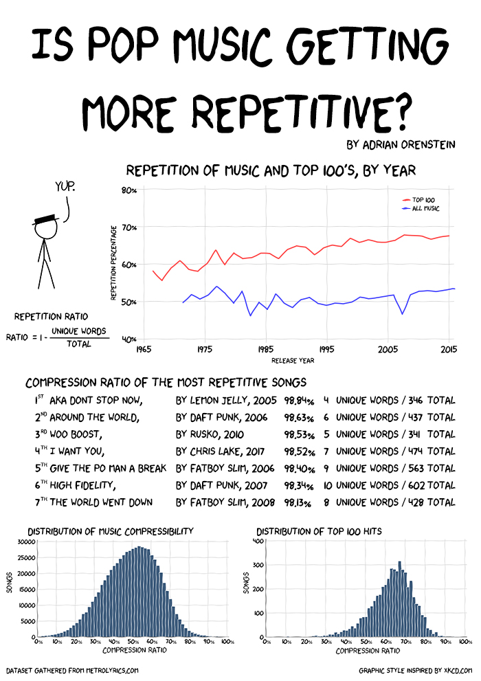

# Is Pop Music Getting More Repetitive?

This is my static data visualization research assignment for "Grand Challenges in Computer science", this project asked us to pose a question that can be answered from a dataset, and with analysis, present your question and our research as a poster.

My question was whether pop music is getting repetitive, the dataset was scraped off of [metrolyrics](http://www.metrolyrics.com/).

You can download my dataset [here](lyricDataset.csv).

## Poster


## Getting Started

These instructions will get you a copy of the project up and running on your local machine for development.

First run through the dependencies installation process.

### Dependencies

install a python3 virtualenv, run: 
```
pip3 -r requirements.txt
```

Fonts used in my visualizations: [xkcd font](fonts/xkcd.ttf) and [Humor-Sans](fonts/Humor-Sans.ttf)

## Generating the Dataset

Python scripts have been named in the order of intended use, a brief descriptions of each of the scripts are below.

### Scraping:

#### 1_ScrapeArtistsA-Z.py
This python script generated a text file called searchSeq which held a metrolyrics link to the parent web page for artists starting with A, B, ... , Y,  Z. 

#### 2_ScrapeArtistsPagesA-Z.py
For every link in searchSeq, get all of the artists with their letter and place them in a file called Artist_[A-Z]

#### 3_ScrapeQueueOfSongs.py
For every artist in each Artist_ file, append to queue.txt the year of their songs produced and the song link.

#### 4_GetSongsOffQueue.py
Read queue.txt and append them to a list of things to operate on, then spawn 50 workers and asynchronously retrieve the lyrics and build the directory structure.

#### 5_SongCompressToCsv.py
For each lyric file in the dataset directory, remove copyright notices and instrumental lyrics. Calculate the repetition ratio by putting the lyrics into a set, and record all needed information into lyricDataset.csv

## Generating the Visualizations

Python scripts used to generate visualizations used in my poster.

### Graphing:

#### Graphs/YearVsCompressionRatioGraph.py
This generates the line graph of Year vs Compression Ratio used in my poster.

#### Graphs/DistribtuionGraph.py
Generates a histogram showing the distribution of the dataset

#### Graphs/DistribtuionGraph_Top100.py
Generates a histogram showing the distribution of the top100 songs dataset from [here](https://github.com/walkerkq/musiclyrics/blob/master/billboard_lyrics_1964-2015.csv)

## Built With

* [Beautiful Soup](https://www.crummy.com/software/BeautifulSoup/) - The web scraper
* [MatplotLib](https://matplotlib.org/) - The graphing library
